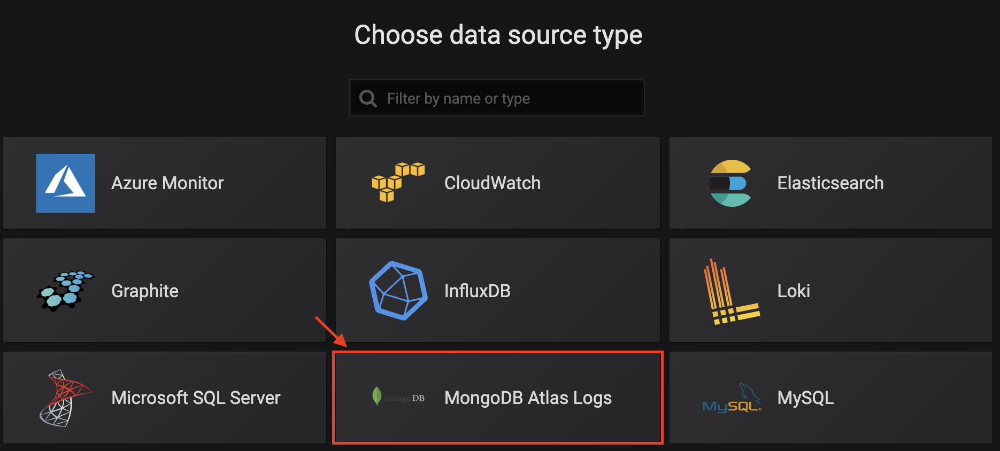
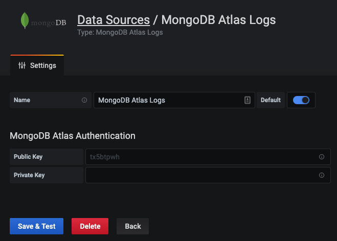

## Grafana MongoDB Atlas Logs Datasource

MongoDB Atlas allows to fetch logs from their service. More information can be found here: https://docs.atlas.mongodb.com/reference/api/logs/

This plugin allows to fetch [process](https://docs.atlas.mongodb.com/reference/api/process-measurements/), [database](https://docs.atlas.mongodb.com/reference/api/process-databases-measurements/) and [disk](https://docs.atlas.mongodb.com/reference/api/process-disks-measurements/) logs from MongoDB Atlas in your Grafana dashboard. This allows you to monitor your whole MongoDB Atlas infrastructure within your grafana dashboards. 

## Installation

### Grafana Setup

You can load the latest plugin version with the following command: 
```bash
grafana-cli --pluginUrl https://github.com/valiton/grafana-mongodb-atlas-datasource/releases/latest.zip plugins install grafana-mongodb-atlas-datasource
```

> Please note that we currently only build for linux. If you have a windows machine, then you have to update the Makefile accordingly

For docker setup add the following environment variable to automatically install the plugin: 
```
docker run -p 3000:3000 -e GF_INSTALL_PLUGINS="https://github.com/valiton/grafana-mongodb-atlas-datasource/releases/latest.zip;grafana-mongodb-atlas-plugin" grafana/grafana
```

For more information about the plugin installation have a look at the [plugin official documentation](https://grafana.com/docs/plugins/installation/).

### Dev setup

This plugin requires node > 8.10 and [dep](https://golang.github.io/dep/docs/installation.html)

```sh
npm install # install JavaScript dependencies
dep ensure  # install go dependencies
make        # build JavaScript frontend and Go backend
```

# Usage

## Create datasource

After installing the datasource in Grafana (see Grafana Setup section), you can create a Grafana datasource. 



Please enter here your Atlas email address and the Atlas API token in the two input fields and click on enter. If the credentials are valid, you will see a green info box. For more information, have a look at the [MongoDB Atlas documentation](TBD) to create these credentials. 



## Create Panel

After setting up the datasource, you are able to create a query for a Grafana panel. You have to first select here the project you want to monitor and the cluster. After that, you can select one of three different metrics: 

1. [Process logs](https://docs.atlas.mongodb.com/reference/api/process-measurements/),
2. [Database logs](https://docs.atlas.mongodb.com/reference/api/process-databases-measurements/) and
3. [Disk logs](https://docs.atlas.mongodb.com/reference/api/process-disks-measurements/)

Next, you are asked different other parameters, such as the database name and then you can select the dimension you want to display in the query. To name the query, please use the `alias` input. You can use `{{name}}` to use metrics or dimensions for the name (see hint field of `alias` for more information). 


> Note: Annotations are not yet supported!

# Contributing
Pull requests for new features, bug fixes, and suggestions are welcome! 

# Release

## 1) Add Release Notes to Changelog in README.md

## 2) Update package.json version

## 3) Create Tag with format vx.y.z

We use semversion format for tagging the releases. 

## 4) Create Relase Zip 

```bash
make
zip -r grafana-mongodb-atlas-datasource-vx_y_z.zip ./* -x node_modules -x vendor -x screenshots
zip -r grafana-mongodb-atlas-datasource-latest.zip ./* -x node_modules -x vendor -x screenshots
```

## 5) Create Release with zip files as Release in Github

see https://help.github.com/en/articles/creating-releases for more information

# Changelog

- **1.0.0** - Initial release

  Support for process, database and disk logs

# License
[MIT](./LICENSE.txt)