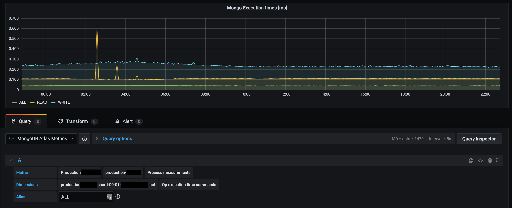
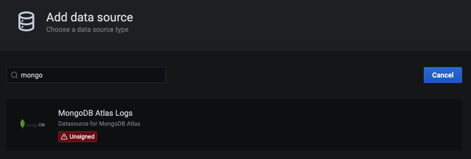
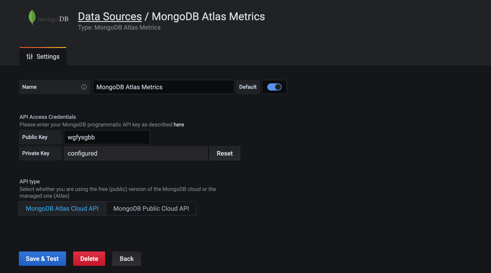

## Grafana MongoDB Atlas Logs Datasource

MongoDB Atlas allows to fetch logs from their service. More information can be found here: https://docs.atlas.mongodb.com/reference/api/logs/

This plugin allows to fetch [process](https://docs.atlas.mongodb.com/reference/api/process-measurements/), [database](https://docs.atlas.mongodb.com/reference/api/process-databases-measurements/) and [disk](https://docs.atlas.mongodb.com/reference/api/process-disks-measurements/) logs from MongoDB Atlas in your Grafana dashboard. This allows you to monitor your whole MongoDB Atlas infrastructure within your grafana dashboards.



## Installation

### Grafana Setup

You can load the latest plugin version with the following command:

```bash
grafana-cli --pluginUrl https://github.com/valiton/grafana-mongodb-atlas-datasource/releases/v3.0.0/download/valiton-mongodb-atlas-datasource.zip plugins install valiton-mongodb-atlas-datasource
```

For docker setup add the following environment variable to automatically install the plugin:

```bash
docker run -p 3000:3000 \
  -e GF_INSTALL_PLUGINS="https://github.com/valiton/grafana-mongodb-atlas-datasource/releases/download/v3.0.0/valiton-mongodb-atlas-datasource.zip;valiton-mongodb-atlas-datasource" \
  -e "GF_PLUGINS_ALLOW_LOADING_UNSIGNED_PLUGINS=valiton-mongodbatlas-datasource" \
  grafana/grafana:8.0.0
```

> **Note:** Plugin ID was changed from `mongodb-atlas-datasource` to `valiton-mongodb-atlas-datasource` from v3.0.0 on due to the new plugin naming convention!

For more information about the plugin installation have a look at the [plugin official documentation](https://grafana.com/docs/plugins/installation/).

# Usage

## Create datasource

After installing the datasource in Grafana (see Grafana Setup section), you can create a Grafana datasource.



Please enter here your programmatic API key credentials in the two input fields and click on enter. If the credentials are valid, you will see a green info box. For more information, have a look at the [MongoDB Atlas documentation](https://docs.atlas.mongodb.com/configure-api-access/#programmatic-api-keys) to create these credentials.



## Create Panel

After setting up the datasource, you are able to create a query for a Grafana panel. You have to first select here the project you want to monitor and the cluster. After that, you can select one of three different metrics:

1. [Process logs](https://docs.atlas.mongodb.com/reference/api/process-measurements/),
2. [Database logs](https://docs.atlas.mongodb.com/reference/api/process-databases-measurements/) and
3. [Disk logs](https://docs.atlas.mongodb.com/reference/api/process-disks-measurements/)

Next, you are asked different other parameters, such as the database name and then you can select the dimension you want to display in the query. To name the query, please use the `alias` input. You can use `{{name}}` to use metrics or dimensions for the name (see hint field of `alias` for more information).


# Dev setup

## Frontend

1. Install dependencies

   ```bash
   yarn install
   ```

2. Build plugin in development mode or run in watch mode

   ```bash
   yarn dev
   ```

   or

   ```bash
   yarn watch
   ```

3. Build plugin in production mode

   ```bash
   yarn build
   ```

## Backend

1. Update [Grafana plugin SDK for Go](https://grafana.com/docs/grafana/latest/developers/plugins/backend/grafana-plugin-sdk-for-go/) dependency to the latest minor version:

   ```bash
   go get -u github.com/grafana/grafana-plugin-sdk-go
   go mod tidy
   ```

2. Build backend plugin binaries for Linux, Windows and Darwin:

   ```bash
   mage -v
   ```

3. List all available Mage targets for additional commands:

   ```bash
   mage -l
   ```

# Limitations

- Annotations are not supported yet

# Contributing

Pull requests for new features, bug fixes, and suggestions are welcome!

# Release

**1. Add Release Notes to Changelog in README.md**

**2. Update version in src/plugin.json**

**3. Update package.json version**

**4. Create Tag with format vx.y.z**
> We use semversion format for tagging the releases.´

**5. Create Relase Zip**

```bash
make
zip -r valiton-mongodb-atlas-datasource.zip ./dist
```

**6. Create Release with zip files as attachment**

see https://help.github.com/en/articles/creating-releases for more information

# Changelog

[Changelog](./CHANGELOG.md)

# License

[MIT](./LICENSE.txt)

# Thanks to

We also want to thank the Grafana team for their [Github Datasource](https://github.com/grafana/github-datasource) that helped us to get started and we also used some of their code parts. This decreased our development effort a lot, which made it easier for us to switch to the new Grafana Plugin v2 version! :-) 
